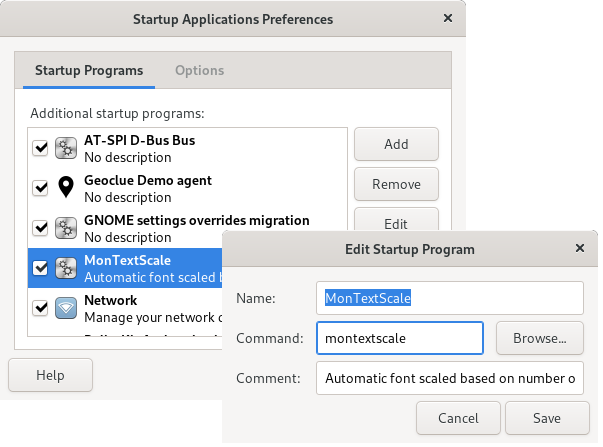

# MonTextScale
[](https://www.gnu.org/licenses/gpl-3.0)

A Python script for automatically adjusting the font scaling in Gnome based on the number of monitors. It was developed for those that sometimes work directly on their laptop and at other times have an additional external monitor connected. 

In case you want to use a different font scaling in Gnome in both these situations, you normally have to start the Gnome Tweak utility and change the font scaling configuration there. This can get annoying and this script's purpose is to automate this configuration change.

By default it configures a font scaling factor of 1.00 in case one or more external monitors are connected and a scaling factor of 1.25 when working directly with just the laptop screen. These font scaling factors can be adjusted with the `-s` and `-m` command line parameters.

## Installation

MonTextScale is a single file Python 3 program called `montextscale.py`. You can copy it to any location you prefer and run it from there. The recommended approach is to copy it to `/usr/bin` and make sure the program is marked as executable:

* `sudo cp montextscale.py /usr/bin/montextscale`
* `sudo chmod +x /usr/bin/montextscale`

## Usage

For testing purposes you can run the script from the terminal. Connect/disconnect your external monitor to verify that the script works. If all works as expected you can stop running it by pressing `CTRL+C` in the terminal. The script can now be added to the list of startup applications. Open Dash -> Startup Applications  and add the `montextscale` command:



## Additional help

For additional details on MonTextScale, run the program with the `--help` parameter:

```
usage: montextscale.py [-h] [-d] [-s SCALING_SINGLE] [-m SCALING_MULTI]

A Python script for automatically adjusting the font scaling in Gnome based on
the number of monitors.

optional arguments:
  -h, --help         show this help message and exit
  -d, --debug        enable debug messages on the standard output.
  -s SCALING_SINGLE  text scaling factor for single screen.
  -m SCALING_MULTI   text scaling factor for multiple screens.

```


